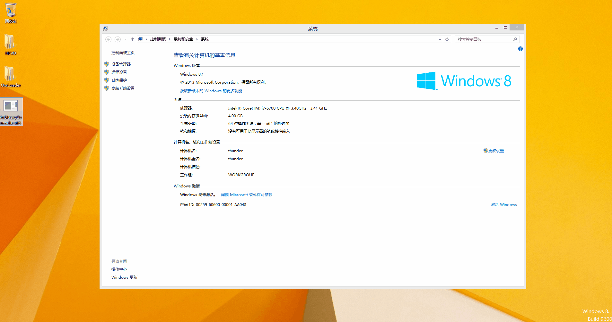
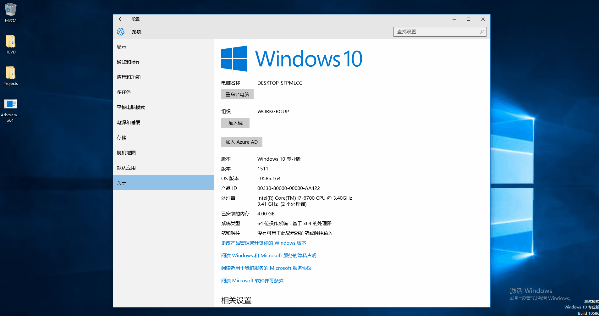
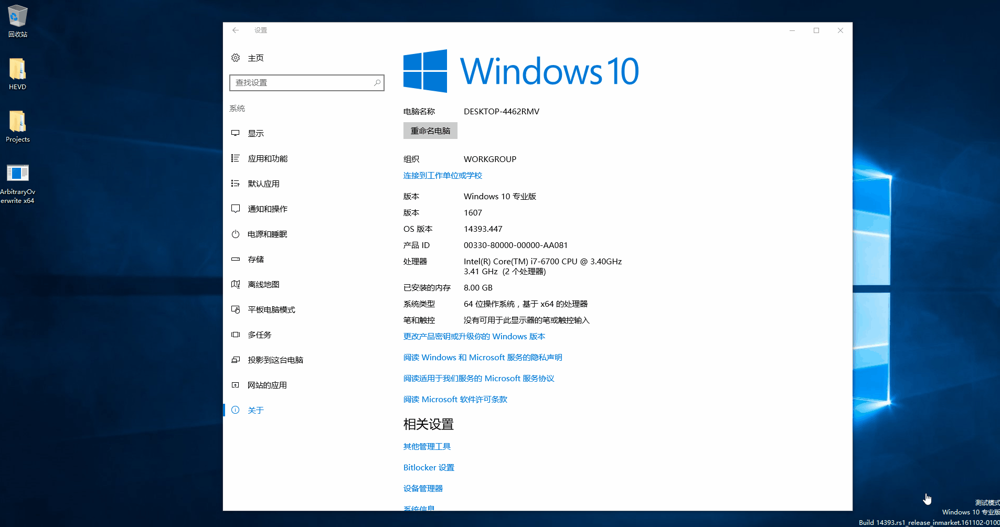

# Write-What-Where

这个项目是HEVD中的Write-What-Where漏洞在win7 x64到win10 x64 1605的利用代码，代码是用C编写的，Win7 x86上的利用在我的名为HEVD的项目中，验证动态图如下：

## [+] Windows 7 x64

## [+] Windows 8.1 x64

## [+] Windows 10 x64 1511

## [+] Windows 10 x64 1607

